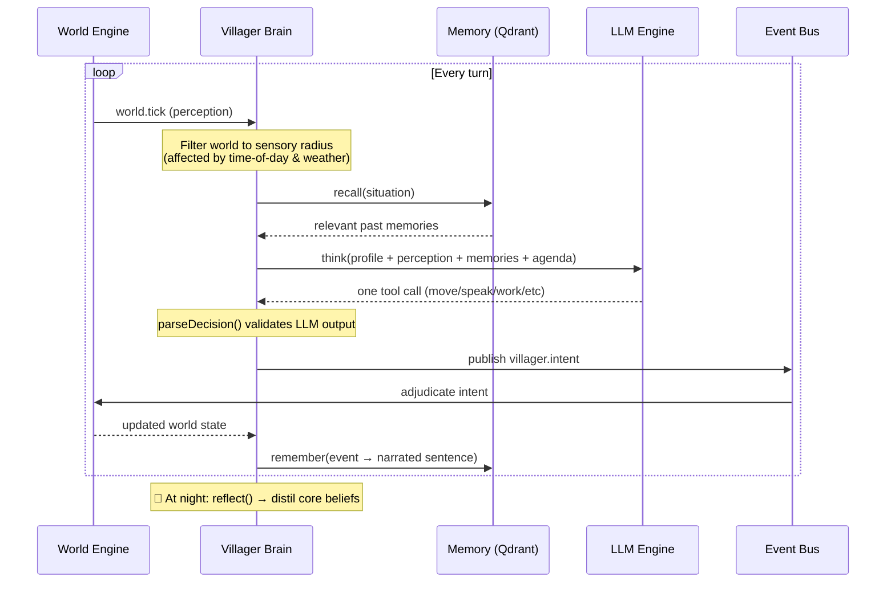

# simVillage — An AI Village That Lives Without You

<p>
  
  
  
  
  
</p>

**Six AI villagers wake up each morning with their own personalities, goals, and
memories. They farm, craft, trade, chat, argue, pray, and build — entirely on
their own. You just watch. Or, if you like, nudge.**

```ascii
    🌲🌲🌲🌲🌲🌲🌲🌲🌲🌲🌲🌲🌲
    🌲  🏛️  🍺  🚜           🌲
    🌲     🏠     🔥          🌲     Day 3 · 14:25, afternoon
    🌲   🧑‍🌾🧑‍🌾           🌲     ──────────────────────
    🌲     🏠     🛕          🌲     Bram wipes the Inn counter.
    🌲  💧     🏠  🌲🌲🌲🌲🌲🌲     Mira works steel at the forge.
    🌲🌲🌲🌲🌲🌲🌲🌲🌲🌲🌲🌲🌲     Tomas squints at the clouds.
```

---

## 🧑‍🌾 Meet the Villagers

```
🧑‍🌾 Bram the Innkeeper    — warm, talkative, nosy in a kind way
  "Keep the Inn the warm heart of the village."

⚒️  Mira the Blacksmith    — gruff, proud, practical, short on small talk
  "Keep the forge ringing with good honest work."

🧑‍🌾 Old Tomas the Farmer   — patient, weather-obsessed, kindly
  "Tend the farm, watch the sky, fret over the harvest."

🙏 Brother Elias the Devout — fervent, persuasive, gentle but relentless
  "Win every neighbour to the Temple of the Dawn."

🪣 Wrenna the Water-Carrier — tireless, neighbourly, methodical
  "Keep the water moving along the chain."

🌲 Pip the Wood-Gatherer    — young, eager, chatty, endlessly curious
  "Keep the craft chain fed and learn every trade."
```

Each has their own **personality**, **goal**, **backstory**, and **daily plan**.
They remember what happened yesterday, form opinions of each other, and pursue
their own purposes — not a script.

---

## 🧠 Architecture

```mermaid
flowchart TB
    subgraph Browser["🖥️ Browser"]
        R["Renderer (Canvas)"]
        P["Panels (Inspector, Roster, Debug...)"]
        NC["NetworkClient (WS)"]
    end

    subgraph Server["🧠 Backend — Single Process"]
        Bus["EventBus (in-process)"]
        WE["WorldEngine<br/>pure simulation core<br/>needs · movement · economy"]
        AG["AgentService × 6<br/>villager brains<br/>Sense → Think → Act"]
        SV["Supervisor<br/>day-scale God Agent<br/>challenges · rewards"]
        TC["TurnCoordinator<br/>LLM-paced clock"]
        GC["GroupCoordinator<br/>shared plans"]
        CT["ConversationTracker<br/>village chat log"]
    end

    subgraph Data["🗄️ Persistence"]
        M[(MongoDB<br/>world state)]
        Q[(Qdrant<br/>vector memory)]
    end

    subgraph AI["🤖 LLM Layer"]
        LLM["LLM Engine<br/>serialized llama access"]
        EMB["Embed Service<br/>nomic-embed-text<br/>768-dim vectors"]
    end

    Browser <-->|WebSocket| NC
    NC <--> Bus
    Bus --- WE & AG & SV & TC & GC & CT
    AG -->|think()| LLM
    AG -->|remember()/recall()| EMB & Q
    WE ---|snapshot| M
```

### Event Bus Topology

The nervous system runs on **topic exchanges** — every message is a typed
`EventEnvelope` with routing keys that keep producers and consumers decoupled:

| Exchange | Flow | Carries |
|----------|------|---------|
| `world.events` | engine → all | `tick`, `map_updated`, `weather_changed` |
| `villager.intents` | villagers → engine | `move`, `speak`, `interact`, `work_at` |
| `user.commands` | browser → engine | `force_move`, `spawn`, `set_weather` |
| `village.events` | aggregator → all | `daily_summary` |
| `supervisor.commands` | God Agent → engine | `spawn_entity`, `plant_idea` |

---

## 🧬 The Villager Brain (Sense → Think → Act)



The LLM never talks to the engine directly. Its only outlet is a **validated
intent envelope** on the bus. Malformed tool calls are dropped. The engine is
the sole source of truth.

---

## 💭 Long-Term Memory (RAG Hippocampus)

Every villager has their own private vector store in **Qdrant**:

```
  Event happens
       ↓
  narrateObservation() → "At 2:25 PM, Bram told me he is hungry."
       ↓
  EmbeddingProvider → 768-dim vector (nomic-embed-text)
       ↓
  QdrantMemoryStore.upsert() → scoped to villagerId
       ↓
  ... later ...
       ↓
  recall(situation) → embed query → similarity search → top-k
       ↓
  Re-ranked by relevance × recency × importance
       ↓
  Injected into the LLM prompt as context
```

At night, `ReflectionLoop` fires once per simulated day: it reads the day's
mundane memories, asks the LLM to distil **core beliefs** and **updated goals**,
and stores those as high-importance reflections. Villagers grow.

---

## ⛓️ The Economy — Two Production Chains

```ascii
  💧 Old Spring ──(haul water)──→ 🚜 Greenfield Farmstead ──(haul food)──→ 🏛️ Hall Town
   (infinite)      🪣 Wrenna        (2 water → 1 food)     🧑‍🌾 Tomas      (village larder)

  🌳 Greywood Grove ──(haul wood)──→ 🔥 Emberfall Forge ──(haul goods)──→ 🍺 The Rolling Pin Inn
   (infinite)       🌲 Pip          (2 wood → 1 goods)    ⚒️  Mira        (tavern, goods)

  🪨 Quarry ──(haul stone)──→ 🏗️ Building Sites (houses, wells, statues, lamps)
   (infinite)
```

Each villager has a **trade** — their own link in the chain. They draw from
inexhaustible sources, haul to converters, and stock the village stores.
Villagers eat, drink, and rest to satisfy **needs** (hunger, thirst, fatigue,
boredom) that rise through the day. Sleep restores. The economy flows.

---

## 👁️ Perception — No God's-Eye View

Villagers only see what's within **their own sensory bubble**:

- **Sight radius** — shrinks at night and in murk (fog, storm, rain)
- **Hearing radius** — unaffected by light, but storms drown distant voices
- Both calculated purely from the shared `tick` + `weather` — everyone derives
  the same radii without wire overhead
- A villager never sees the whole map. They must **walk** to someone to talk.

---

## 🚀 Quick Start

```bash
cp .env.example .env
docker compose up --build
```

Open **http://localhost:5173** — RabbitMQ admin at **http://localhost:15672** (`guest`/`guest`).

### Dev mode (hot reload)

```bash
docker compose -f docker-compose.yml -f docker-compose.dev.yml up
```

### Local (no Docker)

Requires MongoDB + RabbitMQ reachable on localhost:

```bash
npm install
npm run typecheck
RABBITMQ_URL=amqp://localhost:5672 MONGO_URL=mongodb://localhost:27017/simvillage \
  npm run dev
```

---

## 📦 Services

| Service | Role | Tech |
|---------|------|------|
| **backend** | World engine + villager brains + gateway | TypeScript, tsx |
| **llm** | Serialized access to llama server | TypeScript |
| **embed** | Embedding vectors for RAG memory | llama.cpp, CUDA |
| **client** | Canvas viewport + HUD panels | Vite, TypeScript |
| **mongo** | Persistent world state | MongoDB 7 |
| **qdrant** | Vector store per villager | Qdrant 1.13 |

---

## ⚙️ Configuration

| Var | Default | Purpose |
|-----|---------|---------|
| `MONGO_URL` | `mongodb://mongo:27017/simvillage` | MongoDB connection |
| `RABBITMQ_URL` | `amqp://rabbitmq:5672` | AMQP broker URL |
| `GATEWAY_WS_PORT` | `8080` | WebSocket port |
| `WORLD_TICK_RATE` | `3` | Simulation ticks/sec |
| `VILLAGER_COUNT` | `5` | How many minds to spawn |
| `VILLAGER_THINK_INTERVAL_MS` | `12000` | Gap between a mind's LLM calls |
| `VILLAGER_SENSE_RADIUS` | `8` | Base sensory radius (tiles) |
| `VILLAGER_MEMORY` | `on` | Long-term RAG memory (needs Qdrant) |
| `LLAMA_URLS` | `http://host.docker.internal:8080` | OpenAI-compatible llama endpoint |
| `EMBED_URLS` | `http://embed:8080` | Embedding server endpoint |
| `EMBED_DIM` | `768` | Vector dimension (match embedding model) |
| `SUPERVISOR_CHARTER` | — | God Agent's standing directive |
| `RECALL_CONVERSATION_CAP` | `2` | Max conversation memories per recall |
| `CLOCK_TICK_SECONDS` | `180` | Simulated seconds per tick |

Full reference in [`.env.example`](.env.example).

---

## 🏗️ Project Structure

```
simVillage/
├── server/          # World engine + coordinators + persistence
│   ├── src/
│   │   ├── WorldEngine.ts        — pure sim core (needs, movement, economy)
│   │   ├── TurnCoordinator.ts    — LLM-paced round clock
│   │   ├── GroupCoordinator.ts   — shared villager plans
│   │   ├── ConversationTracker.ts— village chat log
│   │   ├── transport/            — EventBus transport layer
│   │   ├── persistence/          — MongoDB stores
│   │   └── world/                — seed generator, CLI map gen
├── agent/           # Villager AI brains
│   ├── src/
│   │   ├── AgentService.ts       — Sense-Think-Act loop
│   │   ├── sensory.ts            — local perception filter
│   │   ├── tools.ts              — LLM tool schemas + validation
│   │   ├── profile.ts            — character identity
│   │   ├── planning/DailyPlanner.ts — morning agenda
│   │   ├── memory/               — RAG hippocampus (Qdrant, reflection)
│   │   ├── llm/                  — LLM client + serial queue
│   │   ├── prompt/               — system prompt assembler
│   │   └── social/               — relationship book
├── client/          # Browser frontend
│   ├── src/
│   │   ├── Renderer.ts           — Canvas viewport + zoom/pan
│   │   ├── NetworkClient.ts      — WebSocket client
│   │   └── *Panel.ts             — Inspector/Roster/Debug/Conversations
├── supervisor/      # God Agent (day-scale LLM)
├── llm/             # LLM engine (serialized llama access)
├── bus/             # Event bus abstraction
├── shared/          # Types, events, buildings, clock, perception
│   ├── types.ts     — Wire protocol (everything is a discriminated union)
│   ├── events.ts    — Bus topology + event envelopes
│   ├── buildings.ts — Resource economy tables
│   ├── simClock.ts  — Tick → in-world date/time (pure functions)
│   └── perception.ts— Sight/hearing radius (pure functions, weather-scaled)
└── docker-compose.yml
```

---

## 🔮 What Makes This Different

- **No scripts** — villagers aren't following a dialogue tree or a quest log.
  They have goals and a world model, and the LLM chooses what to do.
- **No shared mind** — each villager has their own private vector store. They
  don't know what other villagers know unless they talk about it.
- **No god's-eye view** — villagers only sense what's nearby. They must walk
  to someone to talk, and they don't know what's happening across the map.
- **Emergent religion** — Brother Elias will seek you out. He will talk to you.
  He will try to bring you to the Temple. This was not scripted.
- **Memories that matter** — a snub, a kindness, a shared meal — all narrated,
  embedded, and recalled. Villagers remember how you treated them.
- **The God Agent** — a meta-LLM that watches the village at day scale and
  nudges: challenges, rewards, weather, planted ideas.
